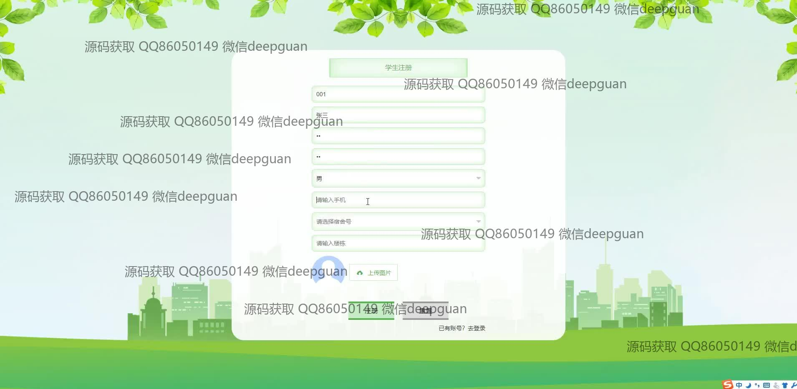
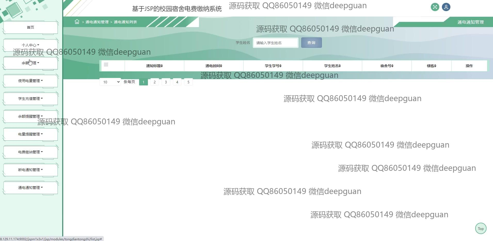

<h1 align="center">基于JSP的校园宿舍电费缴纳系统</h1>

## 简介
校园宿舍电费缴纳系统：角色分为管理员和学生；提供电费查询、缴纳、余额管理、宿舍信息管理等功能，支持在线支付及公告、通知管理，提高电费管理效率。    --计算机毕业设计源码；毕设源码；java毕业设计源码

## 联系方式

<h3 align="center">获取完整代码与数据库文件 + 微信：deepguan QQ: 86050149 QQ群: 783742310</h3>

<h3 align="center">可帮忙远程部署 包运行成功！提供远程部署、修改代码、设计文档指导、代码讲解等服务！</h3>

## 功能介绍（完整见运行截图）
管理员：登录、注册、退出；导航页面管理，包含首页、个人中心、学生管理、宿舍信息管理；电费管理功能，包括用电量查询、电费扣除、充值管理；系统管理功能，例如断电通知管理、公告编辑等。

学生：账号注册和登录；访问主页和个人中心查看或修改个人信息；宿舍电费查询，缴费记录查看，以及线上支付功能；宿舍信息管理，包括宿舍配置、入住人数调整和宿舍图片上传。

## 运行截图

本代码来源于网络,仅供学习参考使用!

